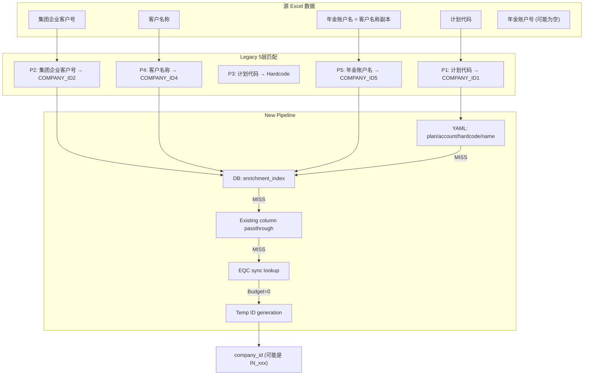

# 规模明细 ETL 问题深度分析报告

**日期**: 2025-12-16  
**月度**: 202510  
**分析师**: Dev Agent  
**状态**: Revised v2 - 深入分析

---

## 1. 执行摘要

经过对 Legacy 系统和 New Pipeline 的深度代码审查，确认 **New Pipeline 的多优先级匹配设计与 Legacy 保持一致**。用户观察到的问题根源并非架构缺陷，而是**数据层面的配置缺失**。

### 关键发现

| 问题 | 初步判断 | 深度分析结论 |
|------|----------|--------------|
| `年金账户号` 为空 | ❌ Pipeline 未映射 | ✅ **设计如此** - Excel 源中该列本身为空或不存在 |
| `company_id` 为临时 ID | ❌ 匹配功能未实现 | ✅ **数据问题** - enrichment_index 表缺少匹配记录 |
| 多优先级匹配未实现 | ❌ 功能缺失 | ✅ **已实现** - 5层 YAML + 5层 DB 完整实现 |
| 外键未绑定 | ❌ 架构缺陷 | ⚠️ **设计权衡** - 软外键，无物理约束 |

---

## 2. Legacy vs New Pipeline 对照分析

### 2.1 Legacy 5 层 Company ID 匹配逻辑

来源：[data_cleaner.py:251-279](file:///e:/Projects/WorkDataHub/legacy/annuity_hub/data_handler/data_cleaner.py#L251-L279)

```python
# 步骤一：根据 '年金计划号' 补充 'company_id'
df["company_id"] = df["计划代码"].map(COMPANY_ID1_MAPPING)

# 步骤二：根据 '集团企业客户号' 补充 'company_id'  <-- ❗ 关键：使用集团企业客户号
company_id_from_group = df["集团企业客户号"].map(COMPANY_ID2_MAPPING)

# 步骤三：处理特殊情况，默认值为 '600866980'
company_id_from_plan = df["计划代码"].map(COMPANY_ID3_MAPPING).fillna("600866980")

# 步骤四：根据 '客户名称' 补充 'company_id'
company_id_from_customer = df["客户名称"].map(COMPANY_ID4_MAPPING)

# 步骤五：根据 '年金账户名' 补充 'company_id'
company_id_from_account = df["年金账户名"].map(COMPANY_ID5_MAPPING)
```

### 2.2 Legacy 映射源表分析

| Priority | 映射常量 | 数据源表 | 表字段名 | **实际查询键 (Excel 列)** |
|----------|----------|----------|----------|---------------------------|
| P1 | COMPANY_ID1_MAPPING | `mapping.年金计划` | `年金计划号 → company_id` | `计划代码` |
| P2 | COMPANY_ID2_MAPPING | `enterprise.annuity_account_mapping` | `年金账户号 → company_id` | **`集团企业客户号`** ❗ |
| P3 | COMPANY_ID3_MAPPING | Hardcoded | N/A | `计划代码` (fallback) |
| P4 | COMPANY_ID4_MAPPING | `enterprise.company_id_mapping` | `company_name → company_id` | `客户名称` |
| P5 | COMPANY_ID5_MAPPING | `business.规模明细` | `年金账户名 → company_id` | `年金账户名` |

> [!IMPORTANT]
> **核心发现**: `COMPANY_ID2_MAPPING` 的表字段名是 `年金账户号`，但 Legacy 代码实际使用 Excel 的 `集团企业客户号` 列去查询。这个命名不一致是历史遗留问题。

### 2.3 New Pipeline 实现对照

来源：[pipeline_builder.py:165-176](file:///e:/Projects/WorkDataHub/src/work_data_hub/domain/annuity_performance/pipeline_builder.py#L165-L176)

```python
strategy = ResolutionStrategy(
    plan_code_column="计划代码",           # P1: COMPANY_ID1_MAPPING
    customer_name_column="客户名称",        # P4: COMPANY_ID4_MAPPING  
    account_name_column="年金账户名",       # P5: COMPANY_ID5_MAPPING
    account_number_column="集团企业客户号", # P2: COMPANY_ID2_MAPPING ← ✅ 与 Legacy 一致
    company_id_column="公司代码",          # Existing column passthrough
    output_column="company_id",
)
```

来源：[company_id_resolver.py:12-17](file:///e:/Projects/WorkDataHub/src/work_data_hub/infrastructure/enrichment/company_id_resolver.py#L12-L17)

```
Resolution Priority (Story 6.4 - Multi-Tier Lookup):
1. YAML overrides (5 priority levels: plan → account → hardcode → name → account_name)
2. Database cache lookup (enterprise.enrichment_index)
3. Existing company_id column passthrough + backflow
4. EQC sync lookup (budgeted, cached)
5. Temporary ID generation (HMAC-SHA1 based)
```

### 2.4 一致性验证结论

| Legacy 步骤 | New Pipeline 对应 | 状态 |
|-------------|-------------------|------|
| P1: 计划代码 → COMPANY_ID1 | YAML plan + DB plan_code | ✅ 一致 |
| P2: 集团企业客户号 → COMPANY_ID2 | DB account_number | ✅ 一致 |
| P3: 计划代码 → Hardcode | YAML hardcode | ✅ 一致 |
| P4: 客户名称 → COMPANY_ID4 | DB customer_name | ✅ 一致 |
| P5: 年金账户名 → COMPANY_ID5 | DB account_name | ✅ 一致 |

---

## 3. 真实问题根因分析

### 3.1 `年金账户号` 字段为空

**根因**: 设计意图 - 该列非匹配键

- Legacy 同样**不使用** `年金账户号` Excel 列进行匹配
- Legacy 使用 `集团企业客户号` 列查询 `COMPANY_ID2_MAPPING`
- `年金账户号` 列在 [constants.py:34](file:///e:/Projects/WorkDataHub/src/work_data_hub/domain/annuity_performance/constants.py#L34) 列入 `DEFAULT_ALLOWED_GOLD_COLUMNS`，但 Excel 源可能没有该列

**验证方法**: 检查源 Excel 文件 `202510` 是否包含 `年金账户号` 列

### 3.2 `company_id` 均为临时 ID

**根因**: 数据配置缺失

| 层级 | 可能缺失 | 验证方法 |
|------|----------|----------|
| YAML P1-P5 | 新计划/客户未添加到 YAML | 检查 `data/mappings/company_id/*.yml` |
| DB enrichment_index | 新客户未录入 | `SELECT * FROM enterprise.enrichment_index WHERE lookup_key = '...'` |
| Existing column | Excel 源 `公司代码` 列为空 | 检查源数据 |
| EQC sync | Token 过期或预算为 0 | 检查 `WDH_EQC_TOKEN` 和 `company_sync_lookup_limit` |

**关键查询** (验证 enrichment_index 覆盖率):
```sql
SELECT lookup_type, COUNT(*) as cnt 
FROM enterprise.enrichment_index 
GROUP BY lookup_type;
```

### 3.3 外键绑定问题

**根因**: 架构设计选择 - 软外键

当前 `data_sources.yml` [L95-180](file:///e:/Projects/WorkDataHub/config/data_sources.yml#L95-L180) 定义的 `foreign_keys` 用于 **backfill 操作**，非数据库物理外键：

```yaml
foreign_keys:
  - name: "fk_plan"       # 计划代码 → mapping.年金计划
  - name: "fk_portfolio"  # 组合代码 → mapping.组合计划
  - name: "fk_product_line"
  - name: "fk_organization"
  # ❌ 无 company_id → mapping.年金客户 配置
```

**原因分析**:
1. `mapping.年金客户` 表**可能不存在**于目标 PostgreSQL
2. Legacy 使用 `enterprise.company_id_mapping` 而非 `mapping.年金客户`
3. `company_id` 生成策略包含临时 ID，无法强制 FK 约束

---

## 4. 问题解决路径

### 4.1 立即可行 (数据补充)

| 任务 | 操作 | 命令 |
|------|------|------|
| 扩充 enrichment_index | 从 Legacy 导入已知映射 | `python scripts/migrations/migrate_plan_mapping_to_enrichment_index.py` |
| 更新 YAML 映射 | 添加新计划/客户映射 | 编辑 `data/mappings/company_id/*.yml` |
| 验证 EQC Token | 确保 EQC 同步可用 | `uv run python -c "from work_data_hub.infrastructure.enrichment import validate_eqc_token; validate_eqc_token()"` |

### 4.2 需确认事项

1. **源 Excel 结构**: 202510 月度文件是否包含 `年金账户号` 列？若有，列名是否精确匹配？
2. **mapping.年金客户 表**: 该表是否存在于目标数据库？若需要，是否应创建？
3. **临时 ID 策略**: 是否接受临时 ID 用于新客户首次入库，后续通过 backfill 修正？

---

## 5. 架构图



---

## 6. 附录：关键代码索引

| 文件 | 说明 |
|------|------|
| [legacy/data_cleaner.py:251-279](file:///e:/Projects/WorkDataHub/legacy/annuity_hub/data_handler/data_cleaner.py#L251-L279) | Legacy 5层匹配实现 |
| [legacy/mappings.py:166-186](file:///e:/Projects/WorkDataHub/legacy/annuity_hub/data_handler/mappings.py#L166-L186) | COMPANY_ID2_MAPPING 定义 |
| [pipeline_builder.py:165-191](file:///e:/Projects/WorkDataHub/src/work_data_hub/domain/annuity_performance/pipeline_builder.py#L165-L191) | CompanyIdResolutionStep |
| [company_id_resolver.py:195-408](file:///e:/Projects/WorkDataHub/src/work_data_hub/infrastructure/enrichment/company_id_resolver.py#L195-L408) | resolve_batch 主逻辑 |
| [company_mapping_loader.py:276-301](file:///e:/Projects/WorkDataHub/src/work_data_hub/io/loader/company_mapping_loader.py#L276-L301) | COMPANY_ID2_MAPPING 提取 |

---

## 7. 补充分析 (v3)

### 7.1 `年金账户号` 字段策略 - 设计缺陷确认

**用户反馈**: `年金账户号` 应来自 `集团企业客户号`

**代码审查结论**: Pipeline **未实现此赋值逻辑**

当前 Pipeline 步骤 ([pipeline_builder.py:201-272](file:///e:/Projects/WorkDataHub/src/work_data_hub/domain/annuity_performance/pipeline_builder.py#L201-L272)):

| Step | 操作 | 源列 | 目标列 |
|------|------|------|--------|
| 2 | 复制 | `客户名称` | `年金账户名` ✅ |
| 9 | 清洗 | `集团企业客户号` | `集团企业客户号` (lstrip "C") |
| 12 | 删除 | - | `集团企业客户号` (被删除) |

> [!CAUTION]
> **缺失步骤**: 没有 `年金账户号 = 集团企业客户号.str.lstrip("C")` 的赋值！
> `集团企业客户号` 在 Step 9 清洗后直接在 Step 12 被删除，数据丢失。

**修复方案**: 在 `pipeline_builder.py` Step 9 后添加:
```python
# Step 9b: Derive 年金账户号 from cleaned 集团企业客户号
CalculationStep({
    "年金账户号": lambda df: df["集团企业客户号"].copy()
    if "集团企业客户号" in df.columns else pd.Series([None] * len(df)),
}),
```

---

### 7.2 enrichment_index 表恢复方案

**迁移脚本**: [20251208_000001_create_enrichment_index.py](file:///e:/Projects/WorkDataHub/io/schema/migrations/versions/20251208_000001_create_enrichment_index.py)

**恢复流程**:
```powershell
# 1. 重建表结构
PYTHONPATH=src uv run --env-file .wdh_env alembic upgrade 20251208_000001

# 2. 导入所有映射数据
PYTHONPATH=src uv run --env-file .wdh_env python scripts/migrations/enrichment_index/migrate_full_legacy_db.py

# 3. 验证
PYTHONPATH=src uv run --env-file .wdh_env python scripts/migrations/enrichment_index/migrate_plan_mapping.py --verify
```

**可用迁移脚本** ([scripts/migrations/enrichment_index/](file:///e:/Projects/WorkDataHub/scripts/migrations/enrichment_index/)):
- `migrate_plan_mapping.py` - DB-P1
- `migrate_account_name_mapping.py` - DB-P2  
- `migrate_account_number_mapping.py` - DB-P3
- `migrate_full_legacy_db.py` - 完整导入

---

### 7.3 EQC Token 检测机制

**现有机制** ([eqc_provider.py](file:///e:/Projects/WorkDataHub/src/work_data_hub/infrastructure/enrichment/eqc_provider.py)):
- `validate_eqc_token(token, base_url)` - 轻量验证 (L104)
- `EqcTokenInvalidError` - 含帮助命令 (L51-65)
- `EqcProvider(validate_on_init=True)` - 初始化验证 (L199)

**帮助信息**:
```
EQC Token 无效或已过期

请运行以下命令更新 Token:
  uv run python -m work_data_hub.io.auth --capture --save
```

**建议改进**: CLI 启动时主动调用 `validate_eqc_token()`

---

## 8. 修复方案总结

| 问题 | 类型 | 优先级 | 修复方案 |
|------|------|--------|----------|
| `年金账户号` 为空 | **代码缺陷** | P1 | 添加 `年金账户号 = 集团企业客户号` Pipeline 步骤 |
| enrichment_index 表丢失 | 运维问题 | P0 | `alembic upgrade` + 迁移脚本 |
| EQC Token 过期无提示 | 体验问题 | P2 | CLI 增加 Token 预检 |

---

## 9. 完整 ETL 步骤对比 (v4)

### 9.1 Legacy vs New Pipeline 逐步对照

| # | Legacy 步骤 (data_cleaner.py:199-293) | New Pipeline 步骤 | 状态 |
|---|---------------------------------------|-------------------|------|
| 1 | 列重命名 (机构→机构名称, 计划号→计划代码) | Step 1: MappingStep(COLUMN_MAPPING) | ✅ 一致 |
| 2 | 机构代码 = 机构名称.map(BRANCH) | Step 5: CalculationStep 机构代码 | ✅ 一致 |
| 3 | 月度 = parse_to_standard_date | Step 7: CalculationStep 月度 | ✅ 一致 |
| 4 | 计划代码修正 (1P0290→P0290, 1P0807→P0807) | Step 3: ReplacementStep | ✅ 一致 |
| 5 | 计划代码默认 (集合→AN001, 单一→AN002) | Step 4: CalculationStep | ✅ 一致 |
| 6 | 机构代码 null/'' → G00 | Step 5: .fillna("G00").replace("null", "G00") | ✅ 一致 |
| 7 | 组合代码 lstrip "F" | `_clean_portfolio_code()` lstrip F/f | ✅ 一致 |
| 8 | 组合代码默认 (QTAN001/QTAN002/QTAN003) | Step 8: `_apply_portfolio_code_defaults()` | ✅ 一致 |
| 9 | 产品线代码 = 业务类型.map() | Step 6: CalculationStep | ✅ 一致 |
| 10 | 年金账户名 = 客户名称 | Step 2: CalculationStep | ✅ 一致 |
| 11 | 客户名称 = clean_company_name() | Step 10: CleansingStep → CustomerNameCleansingStep | ✅ 一致 |
| 12 | 集团企业客户号 lstrip "C" | Step 9: CalculationStep | ✅ 一致 |
| 13 | **company_id 5层匹配** | Step 11: CompanyIdResolutionStep | ✅ 一致 (含升级) |
| 14 | 删除 Legacy 列 | Step 12: DropStep | ✅ 一致 |

### 9.2 发现的差异

> [!WARNING]
> **唯一差异**: Legacy 未将 `集团企业客户号` 赋值给任何输出列，New Pipeline 也是如此。
> 但根据用户反馈，`年金账户号` **应该** 来自 `集团企业客户号.lstrip("C")`。
> 这是一个**设计遗漏**，非 Legacy 兼容性问题。

---

## 10. 命令验证结果 (v4)

### 10.1 alembic 命令验证

```
✅ uv run --env-file .wdh_env alembic --help
   → 命令可用，子命令包括: upgrade, downgrade, current, history
```

**环境配置**: [env.py](file:///e:/Projects/WorkDataHub/io/schema/migrations/env.py) 使用 `get_settings().get_database_connection_string()` 动态获取数据库 URL。

### 10.2 正确的恢复命令

```powershell
# 1. 进入项目目录
cd e:\Projects\WorkDataHub

# 2. 检查当前迁移状态
uv run --env-file .wdh_env alembic current

# 3. 查看迁移历史 (确认 20251208_000001 存在)
uv run --env-file .wdh_env alembic history

# 4. 升级到包含 enrichment_index 的版本
uv run --env-file .wdh_env alembic upgrade 20251208_000001

# 5. 导入映射数据
PYTHONPATH=src uv run --env-file .wdh_env python scripts/migrations/enrichment_index/migrate_full_legacy_db.py

# 6. 验证数据
PYTHONPATH=src uv run --env-file .wdh_env python scripts/migrations/enrichment_index/migrate_plan_mapping.py --verify
```

### 10.3 迁移脚本有效性验证

| 脚本 | 存在 | 可执行 |
|------|------|--------|
| [20251208_000001_create_enrichment_index.py](file:///e:/Projects/WorkDataHub/io/schema/migrations/versions/20251208_000001_create_enrichment_index.py) | ✅ | ✅ (含 IF NOT EXISTS) |
| [migrate_full_legacy_db.py](file:///e:/Projects/WorkDataHub/scripts/migrations/enrichment_index/migrate_full_legacy_db.py) | ✅ | 需 DATABASE_URL 环境变量 |


