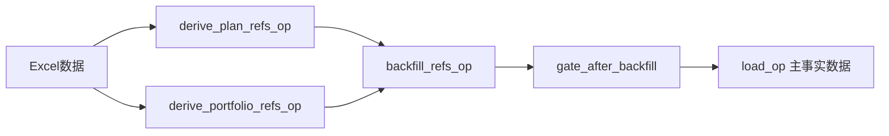

# 自动引用回填机制 (Auto Reference Backfill)

## 概述

WorkDataHub 的自动引用回填机制是一个通用的 ETL 组件，用于在处理事实数据之前自动创建缺失的引用数据。该机制确保外键完整性，避免数据加载时的约束违规错误。

## 核心特性

- ✅ **配置驱动**: 通过 `data_sources.yml` 配置引用表结构
- ✅ **事务安全**: 使用 PostgreSQL savepoint 机制处理失败场景
- ✅ **多表支持**: 同时处理多个引用表（如计划表、投资组合表）
- ✅ **冲突处理**: 支持 `insert_missing` 和 `fill_null_only` 模式
- ✅ **Domain通用**: 可扩展到任何业务域

## 工作流程



### 详细步骤

1. **候选数据派生** (`derive_*_refs_op`)
   - 从处理后的事实数据中提取唯一的引用实体
   - 应用业务规则进行数据聚合和清洗

2. **自动回填执行** (`backfill_refs_op`)
   - 根据配置连接数据库
   - 使用 `insert_missing` 避免主键冲突
   - 事务安全：失败时回滚到savepoint

3. **验证门控** (`gate_after_backfill`)
   - 验证回填操作结果
   - 传递事实数据到下游

4. **主数据加载** (`load_op`)
   - 加载事实数据，外键约束得到满足

## 当前实现状态

### 已实现：annuity_performance 域

**引用表配置：**
```yaml
# src/work_data_hub/config/data_sources.yml
domains:
  annuity_performance:
    refs:
      plans:
        schema: public
        table: "年金计划"
        key: ["年金计划号"]
        updatable: ["计划全称", "计划类型", "客户名称", "company_id", ...]
      portfolios:
        schema: public
        table: "组合计划"
        key: ["组合代码"]
        updatable: ["组合名称", "组合类型", "运作开始日"]
```

**业务逻辑：**
- `derive_plan_candidates()`: 从规模明细数据派生年金计划信息
- `derive_portfolio_candidates()`: 派生投资组合信息

## 扩展到其他Domain

### Step 1: 配置扩展

在 `src/work_data_hub/config/data_sources.yml` 中添加新域：

```yaml
domains:
  your_new_domain:
    description: "新业务域描述"
    refs:
      plans:                    # 或其他引用表名
        schema: public
        table: "新域计划表"      # 实际数据库表名
        key: ["计划编号"]        # 主键字段
        updatable: [            # 可更新字段列表
          "计划名称",
          "客户名称",
          "状态",
          "company_id"
        ]
      # 可以添加更多引用表
      other_ref_table:
        schema: public
        table: "其他引用表"
        key: ["reference_id"]
        updatable: ["name", "description"]
```

### Step 2: 业务逻辑实现

在 `src/work_data_hub/domain/reference_backfill/service.py` 中添加派生函数：

```python
def derive_your_domain_plan_candidates(
    processed_rows: List[Dict[str, Any]]
) -> List[Dict[str, Any]]:
    """
    为新域派生计划候选数据。

    根据您的业务规则实现：
    - 数据分组逻辑
    - 字段聚合规则
    - 数据清洗和验证

    Args:
        processed_rows: 处理后的事实数据行

    Returns:
        准备插入引用表的候选数据列表
    """
    if not processed_rows:
        return []

    # 实现您的业务逻辑
    candidates = []

    # 示例：按某个键分组
    grouped_data = defaultdict(list)
    for row in processed_rows:
        key = row.get("your_key_field")
        if key:
            grouped_data[key].append(row)

    # 为每个组创建候选记录
    for key, rows in grouped_data.items():
        candidate = {
            "计划编号": key,  # 匹配数据库主键
            "计划名称": rows[0].get("name_field"),
            "客户名称": _extract_customer_name(rows),
            # ... 其他字段映射
        }
        candidates.append(candidate)

    return candidates
```

### Step 3: Orchestration集成

创建新的ops和job：

```python
# src/work_data_hub/orchestration/ops.py

@op
def derive_your_domain_plan_refs_op(
    context: OpExecutionContext,
    processed_rows: List[Dict[str, Any]],
) -> List[Dict[str, Any]]:
    """为新域派生计划引用候选数据"""
    try:
        candidates = derive_your_domain_plan_candidates(processed_rows)

        context.log.info(
            "Plan candidate derivation completed",
            extra={
                "input_rows": len(processed_rows),
                "unique_plans": len(candidates),
                "domain": "your_new_domain",
            },
        )

        return candidates
    except Exception as e:
        context.log.error(f"Plan candidate derivation failed: {e}")
        raise

# src/work_data_hub/orchestration/jobs.py

@job
def your_new_domain_job():
    """新域的完整ETL作业"""
    # 复用现有的通用ops
    discovered_paths = discover_files_op()
    excel_rows = read_excel_op(discovered_paths)
    processed_data = process_your_domain_op(excel_rows, discovered_paths)

    # 派生引用数据
    plan_candidates = derive_your_domain_plan_refs_op(processed_data)
    # portfolio_candidates = derive_your_domain_portfolio_refs_op(processed_data) # 如需要

    # 复用通用回填机制！
    backfill_result = backfill_refs_op(plan_candidates, [])  # 第二个参数传空列表或portfolio数据

    # 复用通用加载流程
    gated_rows = gate_after_backfill(processed_data, backfill_result)
    load_op(gated_rows)
```

### Step 4: 注册和测试

1. **注册Job**：在 `src/work_data_hub/orchestration/repository.py` 中添加新job

2. **测试验证**：
```bash
# Plan-only模式测试
uv run python -m src.work_data_hub.orchestration.jobs \
  --domain your_new_domain \
  --plan-only \
  --backfill-refs plans \
  --debug

# 完整执行测试
uv run python -m src.work_data_hub.orchestration.jobs \
  --domain your_new_domain \
  --execute \
  --backfill-refs plans \
  --debug
```

## 配置参数说明

### backfill_refs_op 配置

```python
@op(
    config_schema={
        "targets": Field(list, default_value=["plans"]),      # 要回填的表：plans, portfolios, all
        "mode": Field(str, default_value="insert_missing"),   # 模式：insert_missing, fill_null_only
        "chunk_size": Field(int, default_value=1000),        # 批处理大小
        "plan_only": Field(bool, default_value=False)        # 仅生成计划，不执行
    }
)
```

### 回填模式对比

| 模式 | 说明 | 适用场景 |
|-----|------|---------|
| `insert_missing` | 插入不存在的记录，跳过冲突 | 首次加载或增量添加 |
| `fill_null_only` | 仅更新NULL字段，不覆盖已有值 | 补充缺失信息 |

## 故障排查

### 常见问题

1. **字段不存在错误**
   ```
   错误: 关系 "表名" 的 "字段名" 字段不存在
   ```
   **解决**: 检查候选数据生成函数中的字段名是否与数据库表结构匹配

2. **外键约束违规**
   ```
   违反外键约束 "约束名"
   ```
   **解决**: 确认回填操作在主数据加载之前执行，检查key字段配置

3. **配置加载失败**
   ```
   Could not load refs config
   ```
   **解决**: 检查 `data_sources.yml` 语法和路径配置

### 调试技巧

1. **使用plan-only模式**验证SQL生成
2. **开启debug日志**查看详细执行信息
3. **检查savepoint**确认事务隔离
4. **验证字段映射**确保候选数据结构正确

## 性能优化建议

1. **调整chunk_size**：根据数据量优化批处理大小
2. **索引优化**：确保引用表主键有适当索引
3. **并发控制**：避免多个job同时回填相同引用表
4. **监控内存使用**：大数据集时考虑流式处理

## 未来扩展计划

- [ ] 支持更复杂的派生规则配置
- [ ] 添加数据质量验证钩子
- [ ] 支持跨域引用数据共享
- [ ] 集成数据血缘追踪

---

*最后更新：2024年9月*
*维护者：WorkDataHub团队*