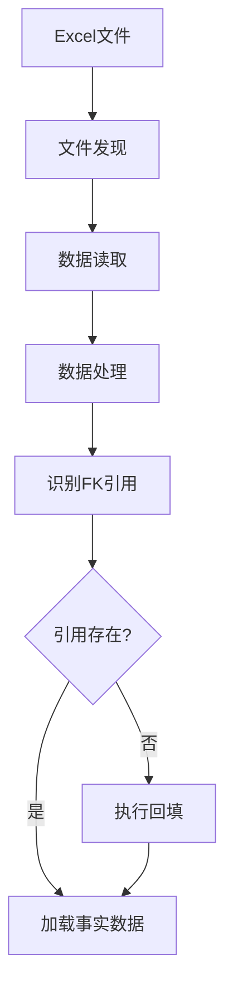

# WorkDataHub 回填机制使用指引

## 概述

WorkDataHub 实现了配置驱动的混合引用数据回填机制，确保在加载事实数据前，所有外键引用都已存在（FK-Safe原则）。本文档详细说明了回填机制的工作原理、配置方法和使用示例。

## 目录

1. [核心概念](#核心概念)
2. [工作流程](#工作流程)
3. [配置文件](#配置文件)
4. [支持的回填目标表](#支持的回填目标表)
5. [使用方法](#使用方法)
6. [配置示例](#配置示例)
7. [最佳实践](#最佳实践)
8. [故障排查](#故障排查)

## 核心概念

### 混合引用数据策略 (AD-011)

项目采用双层架构设计：

- **Pre-load层**: 从权威数据源预先同步引用数据（`reference_sync.yml`）
- **Backfill层**: 动态回填处理过程中发现的缺失引用（`foreign_keys.yml`）

### FK-Safe原则

确保数据加载的外键安全顺序：
1. 识别事实数据中的外键引用
2. 检查引用表是否存在对应记录
3. 回填缺失的引用数据
4. 在引用完整后加载事实数据

## 工作流程



### 执行步骤

1. **文件发现**: 基于域配置自动发现数据文件
2. **数据读取**: 读取Excel数据并执行域特定转换
3. **引用识别**: 从处理后的数据中提取外键候选值
4. **回填执行**: 批量插入缺失的引用记录
5. **数据加载**: 将事实数据加载到目标表

## 配置文件

### 1. 外键回填配置 - `config/foreign_keys.yml`

定义外键映射关系和回填规则：

```yaml
schema_version: "1.1"  # v1.1 adds aggregation support (Story 6.2-P15)

domains:
  annuity_performance:
    foreign_keys:
      - name: "fk_plan"
        source_column: "计划代码"
        target_table: "年金计划"
        target_key: "年金计划号"
        target_schema: "mapping"
        mode: "insert_missing"
        backfill_columns:
          - source: "计划代码"
            target: "年金计划号"
          - source: "计划名称"
            target: "计划全称"
            optional: true
```

### 2. 引用数据同步配置 - `config/reference_sync.yml`

定义权威数据源的预加载配置：

```yaml
schema_version: "1.0"
enabled: true
schedule: "0 1 * * *"
batch_size: 5000

tables:
  - name: "年金计划"
    target_table: "年金计划"
    target_schema: "business"
    source_type: "postgres"
    source_config:
      connection_env_prefix: "WDH_LEGACY"
      schema: "enterprise"
      table: "annuity_plan"
```

### 3. 域数据源配置 - `config/data_sources.yml`

定义文件发现模式和输出配置：

```yaml
schema_version: "1.1"

defaults:
  version_strategy: "highest_number"
  output:
    schema_name: "business"

domains:
  annuity_performance:
    base_path: "tests/fixtures/real_data/{YYYYMM}/收集数据/数据采集"
    file_patterns:
      - "*规模收入数据*.xlsx"
    output:
      table: "annuity_performance"
```

## 支持的回填目标表

### 1. 年金计划表 (`mapping.年金计划`)

**表结构**:
```sql
CREATE TABLE mapping.年金计划 (
  annuity_plans_id INTEGER GENERATED ALWAYS AS IDENTITY PRIMARY KEY,
  年金计划号 VARCHAR(255) NOT NULL,
  计划全称 VARCHAR(255),
  主拓代码 VARCHAR(10),
  计划类型 VARCHAR(255),
  客户名称 VARCHAR(255),
  管理资格 VARCHAR(255),
  主拓机构 VARCHAR(10),
  created_at TIMESTAMP WITH TIME ZONE DEFAULT CURRENT_TIMESTAMP,
  updated_at TIMESTAMP WITH TIME ZONE DEFAULT CURRENT_TIMESTAMP
);
```

**映射字段**:
| 源字段 | 目标字段 | 类型 | 必填 | 聚合策略 |
|--------|----------|------|------|----------|
| 计划代码 | 年金计划号 | VARCHAR(255) | ✅ | - |
| 计划名称 | 计划全称 | VARCHAR(255) | ⚪ | first |
| 计划类型 | 计划类型 | VARCHAR(255) | ⚪ | first |
| 客户名称 | 客户名称 | VARCHAR(255) | ⚪ | first |
| 机构代码 | 主拓代码 | VARCHAR(10) | ⚪ | **max_by**(期末资产规模) |
| 机构名称 | 主拓机构 | VARCHAR(10) | ⚪ | **max_by**(期末资产规模) |
| 业务类型 | 管理资格 | VARCHAR(255) | ⚪ | **concat_distinct**(+) |

### 2. 组合计划表 (`mapping.组合计划`)

**依赖关系**: 需要先回填年金计划数据
**主键**: 组合代码
**外键**: 年金计划号（引用年金计划表）

### 3. 产品线表 (`mapping.产品线`)

**特殊说明**: 产品线代码由业务类型通过映射规则生成
**映射规则**: `BUSINESS_TYPE_CODE_MAPPING` in `infrastructure/mappings/shared.py`

### 4. 组织架构表 (`mapping.组织架构`)

**特殊处理**: 支持跳过空白值（`skip_blank_values: true`）
**主键**: 机构代码

## 使用方法

### CLI 命令

```bash
# 启用所有回填
python -m work_data_hub.cli etl annuity_performance \
  --backfill-refs all \
  --backfill-mode insert_missing

# 仅回填计划数据
python -m work_data_hub.cli etl annuity_performance \
  --backfill-refs plans

# 仅执行回填不加载事实数据
python -m work_data_hub.cli etl annuity_performance \
  --skip-facts \
  --backfill-refs portfolios

# 仅查看回填计划（不实际执行）
python -m work_data_hub.cli etl annuity_performance \
  --plan-only \
  --backfill-refs all
```

### 参数说明

| 参数 | 选项 | 说明 |
|------|------|------|
| `--backfill-refs` | `plans`, `portfolios`, `all` | 启用回填的引用类型 |
| `--backfill-mode` | `insert_missing`, `fill_null_only` | 回填模式 |
| `--skip-facts` | 标志位 | 跳过事实数据加载 |
| `--plan-only` | 标志位 | 仅生成执行计划 |

## 配置示例

### 添加新的回填规则

在 `config/foreign_keys.yml` 中添加：

```yaml
domains:
  annuity_performance:
    foreign_keys:
      # 现有规则...

      # 新增规则示例
      - name: "fk_fund_manager"
        source_column: "基金经理代码"
        target_table: "基金经理"
        target_key: "经理代码"
        target_schema: "mapping"
        mode: "insert_missing"
        skip_blank_values: true
        backfill_columns:
          - source: "基金经理代码"
            target: "经理代码"
          - source: "基金经理姓名"
            target: "经理姓名"
          - source: "基金经理所属公司"
            target: "所属公司"
            optional: true
```

### 配置依赖关系

```yaml
- name: "fk_portfolio_detail"
  source_column: "组合明细代码"
  target_table: "组合明细"
  target_key: "明细代码"
  target_schema: "mapping"
  depends_on: ["fk_plan", "fk_portfolio"]  # 依赖其他FK
  mode: "insert_missing"
```

### 配置聚合策略 (Story 6.2-P15)

当一个主键对应多条源数据记录时，可以使用聚合策略来决定如何填充目标字段。

#### 可用的聚合类型

| 类型 | 说明 | 必填参数 | 可选参数 |
|------|------|----------|----------|
| `first` | 默认策略，取第一个非空值 | 无 | 无 |
| `max_by` | 取指定排序列最大值对应的记录 | `order_column` | 无 |
| `concat_distinct` | 将不重复值用分隔符连接 | 无 | `separator` (默认"+"), `sort` (默认true) |

#### 示例：max_by 聚合

当需要从具有最大资产规模的记录中获取机构代码时：

```yaml
backfill_columns:
  - source: "机构代码"
    target: "主拓代码"
    optional: true
    aggregation:
      type: "max_by"
      order_column: "期末资产规模"
```

**行为说明**：
- 按 `order_column` 列的值排序，选择最大值对应的记录
- 如果所有 `order_column` 值均为 NULL，自动降级为 `first` 策略
- 如果 `order_column` 列不存在，记录警告日志并降级为 `first`

#### 示例：concat_distinct 聚合

当需要将多条记录的业务类型合并为一个字段时：

```yaml
backfill_columns:
  - source: "业务类型"
    target: "管理资格"
    optional: true
    aggregation:
      type: "concat_distinct"
      separator: "+"
      sort: true
```

**行为说明**：
- 去除重复值后，使用指定分隔符连接
- 当 `sort: true` 时，按字符串顺序排序后连接
- 如果所有值均为 NULL，返回 `NULL`（与 optional 字段处理一致）

#### 完整配置示例（年金计划表）

```yaml
- name: "fk_plan"
  source_column: "计划代码"
  target_table: "年金计划"
  target_key: "年金计划号"
  target_schema: "mapping"
  mode: "insert_missing"
  backfill_columns:
    - source: "计划代码"
      target: "年金计划号"
    - source: "计划名称"
      target: "计划全称"
      optional: true
    - source: "计划类型"
      target: "计划类型"
      optional: true
    # max_by: 选择资产规模最大记录的机构信息
    - source: "机构代码"
      target: "主拓代码"
      optional: true
      aggregation:
        type: "max_by"
        order_column: "期末资产规模"
    - source: "机构名称"
      target: "主拓机构"
      optional: true
      aggregation:
        type: "max_by"
        order_column: "期末资产规模"
    # concat_distinct: 合并所有业务类型
    - source: "业务类型"
      target: "管理资格"
      optional: true
      aggregation:
        type: "concat_distinct"
        separator: "+"
        sort: true
```

#### 边界情况处理

| 场景 | max_by 行为 | concat_distinct 行为 |
|------|-------------|---------------------|
| 空 DataFrame | 返回空结果 | 返回空结果 |
| 所有 order_column 为 NULL | 降级为 first | N/A |
| order_column 列不存在 | 降级为 first（记录警告） | N/A |
| 所有值为 NULL | 返回 NULL | 返回 NULL |
| 混合 NULL/非NULL 值 | 选择非NULL最大值对应记录 | 仅连接非NULL值 |
| 多组混合场景 | 每组独立处理，部分组可降级 | 每组独立处理 |

## 最佳实践

### 1. 字段映射规范

- **必填字段**: 始终标记主键字段为必填
- **可选字段**: 使用 `optional: true` 标记非必需字段
- **长度限制**: 注意目标字段的长度限制（如主拓代码限10字符）
- **数据类型**: 确保源字段与目标字段数据类型兼容

### 2. 性能优化

- **批量处理**: 使用适当的批量大小（默认5000）
- **索引优化**: 确保目标表的主键和查找字段有索引
- **依赖顺序**: 正确配置 `depends_on` 确保回填顺序

### 3. 数据质量

- **空值处理**: 使用 `skip_blank_values` 跳过无意义的值
- **重复检查**: `insert_missing` 模式自动避免重复
- **验证规则**: 在数据处理层进行数据验证

### 4. 错误处理

- **日志记录**: 回填操作会记录详细的执行日志
- **错误恢复**: 支持重试机制和部分失败处理
- **监控告警**: 集成监控指标跟踪回填成功率

## 故障排查

### 常见问题

1. **配置文件格式错误**
   - 检查YAML语法，确保缩进正确
   - 验证schema_version是否正确

2. **字段映射失败**
   - 确认源字段在数据中存在
   - 检查目标表结构是否正确

3. **依赖关系错误**
   - 确保 `depends_on` 列出的FK规则存在
   - 检查循环依赖

4. **权限问题**
   - 确认数据库连接权限
   - 检查目标表的写入权限

### 调试命令

```bash
# 检查配置文件
python -c "
from work_data_hub.domain.reference_backfill.config_loader import load_foreign_keys_config
config = load_foreign_keys_config(domain='annuity_performance')
print(f'Loaded {len(config)} FK configurations')
"

# 查看回填统计
python -m work_data_hub.cli etl annuity_performance \
  --plan-only \
  --backfill-refs all
```

### 日志位置

- **应用日志**: `{log_dir}/work_data_hub.log`
- **ETL执行日志**: `{log_dir}/etl.log`
- **Dagster Web UI**: http://localhost:3000

## 相关文档

- [领域迁移开发指南](../domain-migration/development-guide.md)
- [技术规范文档](../../sprint-artifacts/tech-spec/)
- [故障排查指南](../../specific/troubleshooting/)

## 版本历史

| 版本 | 日期 | 更新内容 |
|------|------|----------|
| 1.1 | 2025-12-20 | 新增聚合策略支持 (max_by, concat_distinct) - Story 6.2-P15 |
| 1.0 | 2025-12-20 | 初始版本，包含回填机制完整说明 |