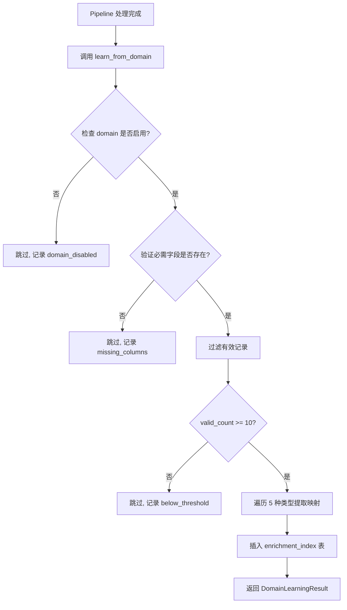

# Enrichment Index 更新机制

本文档描述 `enterprise.enrichment_index` 表格的更新机制，该表格是 `company_id` 多优先级匹配的核心缓存层。

## 概述

`enrichment_index` 是一个**只增不删**的缓存表，支持多种来源的映射数据插入和更新，但不会自动过期或清理。

---

## 更新机制

### 一、UPSERT 语义（核心机制）

所有写入操作通过 `insert_enrichment_index_batch()` 方法执行，使用 PostgreSQL `ON CONFLICT DO UPDATE`：

```sql
ON CONFLICT (lookup_key, lookup_type) DO UPDATE SET
    confidence = GREATEST(existing, new),  -- 保留更高置信度
    company_id = CASE WHEN new_confidence > existing THEN new ELSE existing END,
    source = CASE WHEN new_confidence > existing THEN new ELSE existing END,
    source_domain = CASE WHEN new_confidence > existing THEN new ELSE existing END,
    source_table = CASE WHEN new_confidence > existing THEN new ELSE existing END,
    hit_count = existing + 1,
    last_hit_at = NOW(),
    updated_at = NOW()
```

**更新规则**：

- 新记录 `confidence` **更高**时：更新 `company_id`、`source`、`source_domain`、`source_table`
- 否则保留原有值，但增加 `hit_count` 和更新时间戳

### 二、命中计数更新

`update_hit_count()` 方法用于单独更新命中统计：

```sql
UPDATE enterprise.enrichment_index
SET hit_count = hit_count + 1,
    last_hit_at = NOW(),
    updated_at = NOW()
WHERE lookup_key = :lookup_key AND lookup_type = :lookup_type
```

---

## 更新触发点

| 触发场景         | 调用链                                                                          | 描述                                                |
| ---------------- | ------------------------------------------------------------------------------- | --------------------------------------------------- |
| **领域学习**     | `DomainLearningService.learn_from_domain()` → `insert_enrichment_index_batch()` | Pipeline 处理完成后，自动从结果中提取已知映射并写入 |
| **EQC API 查询** | `EqcProvider._cache_result()` → `insert_enrichment_index_batch()`               | EQC 成功查询后，缓存结果到 `enrichment_index`       |
| **数据迁移**     | `migrate_legacy_to_enrichment_index.py` → `insert_enrichment_index_batch()`     | 一次性从旧表迁移数据                                |

---

## 领域学习 (Domain Learning) 详解

### 触发时机

当 Pipeline 处理完成后，`DomainLearningService.learn_from_domain()` 从处理结果 DataFrame 中提取有效的 `company_id` 映射。

### 提取的 5 种映射类型

| LookupType       | 中文名        | 源字段 (annuity\_\*)    | 置信度 | 是否需要归一化                                  |
| ---------------- | ------------- | ----------------------- | ------ | ----------------------------------------------- |
| `PLAN_CODE`      | 计划代码      | `计划代码`              | 0.95   | 否                                              |
| `ACCOUNT_NAME`   | 年金账户名    | `年金账户名`            | 0.90   | 否                                              |
| `ACCOUNT_NUMBER` | 年金账户号    | `年金账户号`            | 0.95   | 否                                              |
| `CUSTOMER_NAME`  | 客户名称      | `客户名称`              | 0.85   | **是**                                          |
| `PLAN_CUSTOMER`  | 计划+客户组合 | `计划代码` + `客户名称` | 0.90   | **是** (格式: `{plan_code}\|{normalized_name}`) |

### 有效记录筛选条件

```python
valid_mask = (
    df["company_id"].notna() &  # company_id 非空
    is_numeric_id &              # 纯数字 (如 "614810477")
    ~is_temp_id                  # 不以 "IN" 开头 (排除临时 ID)
)
```

### 提取流程



### 写入数据结构

每条提取的映射创建一个 `EnrichmentIndexRecord`：

```python
EnrichmentIndexRecord(
    lookup_key="FP0001",                     # 查找键 (可能经过归一化)
    lookup_type=LookupType.PLAN_CODE,        # 查找类型
    company_id="614810477",                  # 公司 ID
    confidence=Decimal("0.95"),              # 置信度
    source=SourceType.DOMAIN_LEARNING,       # 来源 = 领域学习
    source_domain="annuity_performance",     # 源领域
    source_table="annuity_performance_new",  # 源表名
)
```

### 默认配置

从 `DomainLearningConfig` 读取：

```yaml
enabled_domains:
  - annuity_performance
  - annuity_income

min_records_for_learning: 10 # 至少 10 条有效记录才触发学习
min_confidence_for_cache: 0.80 # 低于此置信度的类型不写入
```

---

## 关键约束

1. **去重**: 每种类型只提取 `DISTINCT (lookup_key, company_id)` 组合
2. **归一化一致性**: `customer_name` 和 `plan_customer` 使用与查询相同的 `normalize_for_temp_id()` 函数
3. **幂等写入**: 使用 `ON CONFLICT DO UPDATE`，更高置信度的新值会覆盖旧值
4. **无自动过期**: 记录不会被自动清理或过期，需手动维护

---

## 相关代码

| 文件                                                                                                                                      | 说明                                                     |
| ----------------------------------------------------------------------------------------------------------------------------------------- | -------------------------------------------------------- |
| [enrichment_index_ops.py](file:///e:/Projects/WorkDataHub/src/work_data_hub/infrastructure/enrichment/repository/enrichment_index_ops.py) | 表操作 Mixin (lookup/insert/update)                      |
| [domain_learning_service.py](file:///e:/Projects/WorkDataHub/src/work_data_hub/infrastructure/enrichment/domain_learning_service.py)      | 领域学习服务                                             |
| [eqc_provider.py](file:///e:/Projects/WorkDataHub/src/work_data_hub/infrastructure/enrichment/eqc_provider.py)                            | EQC API 缓存写入                                         |
| [types.py](file:///e:/Projects/WorkDataHub/src/work_data_hub/infrastructure/enrichment/types.py)                                          | 类型定义 (LookupType, SourceType, EnrichmentIndexRecord) |
