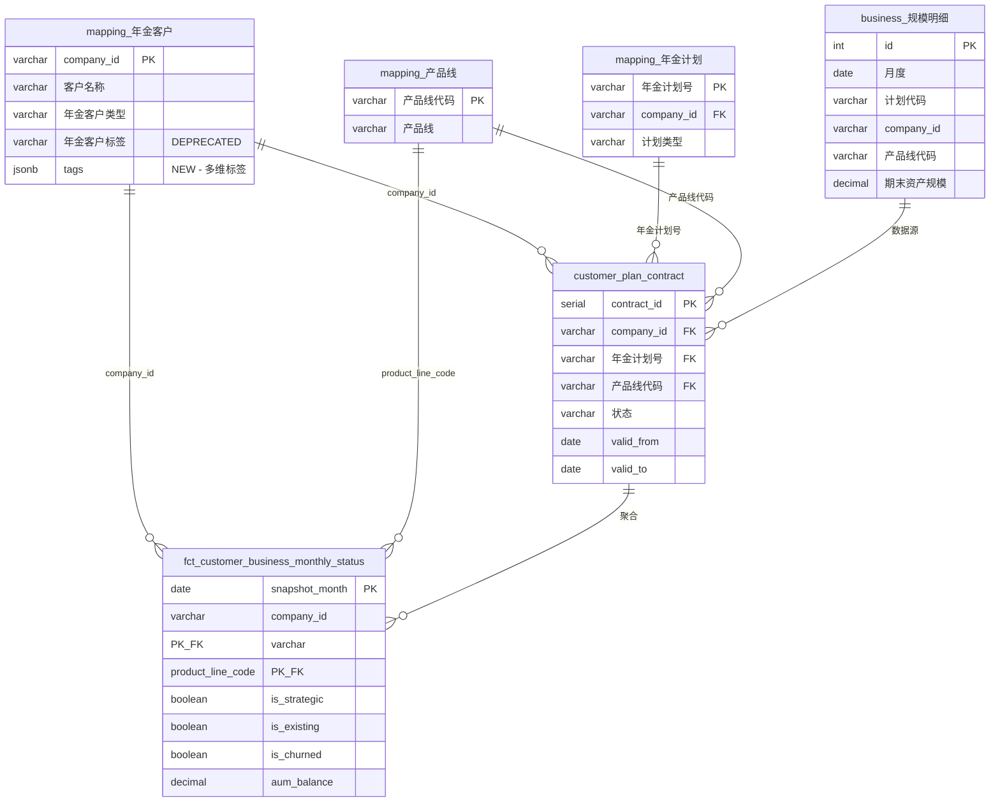

# Sprint Change Proposal: Customer Identity MDM & Monthly Snapshot Model

**Generated**: 2026-01-10  
**Triggered by**: [customer-identity-monthly-snapshot-implementation-v3.2-project-based.md](file:///e:/Projects/WorkDataHub/docs/specific/customer-db-refactor/customer-identity-monthly-snapshot-implementation-v3.2-project-based.md)  
**Change Scope**: **Major** (New Epic Required)

---

## 1. Issue Summary

### 1.1 Problem Statement

The current WorkDataHub project lacks a comprehensive **Customer Master Data Management (MDM)** solution for tracking customer identity across time. While Epic 6 addresses company ID enrichment for cross-domain joins, there is no mechanism to:

1. **Track customer status transitions** (战客/已客/中标/流失) over time
2. **Generate monthly snapshots** for historical trend analysis
3. **Manage customer-plan contract relationships** (SCD Type 2)
4. **Distinguish product lines** (企年受托/企年投资/职年受托/职年投资) in customer analysis

### 1.2 Discovery Context

This proposal emerged from a parallel workstream analyzing the `legacy` PostgreSQL database structure, specifically:
- `mapping."年金客户"` (10,436 records) - existing customer dimension
- `mapping."年金计划"` (1,158 records) - existing plan dimension
- `business."规模明细"` (625,126 rows, 2022-2025) - core business data

### 1.3 Evidence

| Data Point | Value | Implication |
|------------|-------|-------------|
| `business.规模明细` rows | 625,126 | Large dataset requiring optimized schema |
| Unique companies | 10,153 | Manageable dimension table size |
| Growth rate (2024-2025) | ~4-5x YoY | Need for scalable design |
| Product lines | 4 (PL201-PL204) | Unified dimension, not redundant business_type |

---

## 2. Impact Analysis

### 2.1 Epic Impact

| Epic | Status | Impact Level | Description |
|------|--------|--------------|-------------|
| Epic 1-4 | Completed | ⚪ None | No retroactive changes needed |
| Epic 5 | Completed | ⚪ None | Infrastructure layer unaffected |
| Epic 6 | In Progress | 🟡 Moderate | Company enrichment may need coordination with MDM |
| **New Epic 7** | Proposed | 🔴 Major | New epic required for Customer MDM |
| Future Epics | Planned | 🟡 Moderate | May consume customer snapshot data |

### 2.2 PRD Impact

| Functional Requirement | Current Status | Required Change |
|------------------------|----------------|-----------------|
| FR-3.3: Company Enrichment | Defined | **Extend** to include customer status tracking |
| FR-4: Database Loading | Defined | **Add** new tables (`customer` schema) |
| FR-8: Monitoring | Defined | **Add** customer snapshot ETL observability |
| **NEW FR-9** | N/A | **Create** Customer MDM requirements |

### 2.3 Architecture Impact

| Component | Current State | Required Change |
|-----------|---------------|-----------------|
| Database Schema | `business`, `mapping`, `enterprise` schemas | **Add** `customer` schema with 2 tables + 1 view |
| ETL Pipeline | Domain-focused (annuity_performance, etc.) | **Add** Customer snapshot ETL job |
| BI Integration | Direct table queries | **Add** star schema model for Power BI |

### 2.4 Artifact Conflicts

| Artifact | Conflict Type | Resolution |
|----------|---------------|------------|
| `docs/architecture/domain-registry.md` | Missing customer domain | Add customer domain registration |
| `docs/epics/index.md` | Missing Epic 7 | Add Epic 7 reference |
| `docs/prd/functional-requirements.md` | Missing FR-9 | Add Customer MDM requirements |

---

## 3. Recommended Approach

### 3.1 Decision: **Create New Epic 7 - Customer Master Data Management**

> [!IMPORTANT]
> This change introduces a new business capability not covered by existing epics. Direct adjustment within Epic 5/6 would violate Single Responsibility Principle.

### 3.2 Rationale

| Factor | Evaluation | Score |
|--------|------------|-------|
| Effort | 4 weeks total (see breakdown below) | Medium |
| Risk | New schema, no existing code dependency | Low |
| Business Value | Historical trend analysis, customer attribution | High |
| Technical Debt | Clean greenfield implementation | Low |
| Timeline Impact | Parallel track, does not block Epic 6 | None |

**工期估算说明**：

| 阶段 | 内容 | 工期 |
|------|------|------|
| **开发工作** | Story 7.0-7.10 (Schema, ETL, Hooks) | 9.5 工作日 (~2周) |
| **BI验证** | Power BI模型核对、数据一致性验证 | 3-5 工作日 |
| **切割上线** | 生产部署、监控配置、文档更新 | 2-3 工作日 |
| **总计** | 完整交付周期 | **~4周** |

> [!NOTE]
> V3.2实施方案中的4周估算包含完整交付周期（开发+验证+上线），本提案Story估算仅覆盖开发工作。

### 3.3 Alternative Approaches Considered

| Option | Pros | Cons | Decision |
|--------|------|------|----------|
| Extend Epic 6 | Simpler epic structure | Scope creep, SRP violation | ❌ Rejected |
| Post-MVP Enhancement | Defer complexity | Business need is immediate | ❌ Rejected |
| **New Epic 7** | Clean separation, proper scope | Additional planning overhead | ✅ Selected |

---

## 4. Detailed Change Proposals

### 4.1 New Epic: Epic 7 - Customer Master Data Management

**Goal**: Build a comprehensive customer identity management system with monthly snapshots for historical trend analysis.

**Proposed Stories**:

| Story ID | Title | Effort |
|----------|-------|--------|
| 7.0 | **Alembic Migration Script** (`004_customer_mdm.py`) | 0.5 days |
| 7.1 | Customer Schema Setup (`customer.customer_plan_contract`) | 0.5 days |
| 7.2 | Monthly Snapshot Table (`customer.fct_customer_business_monthly_status`) | 0.5 days |
| 7.3 | Business Type Aggregation View | 0.5 days |
| 7.4 | **Customer Tags JSONB Migration** (见下方说明) | 0.5 days |
| 7.5 | Historical Data Backfill (12-24 months) | 1 day |
| 7.6 | Contract Status Sync (**Post-ETL Hook**) | 1.5 days |
| 7.7 | Monthly Snapshot Refresh (**Post-ETL Hook**) | 1.5 days |
| 7.8 | Power BI Star Schema Integration | 1 day |
| 7.9 | Index & Trigger Optimization (BRIN, Partial, `trg_sync_product_line_name`) | 0.5 days |
| 7.10 | Integration Testing & Documentation | 1 day |

**Total Estimated Effort**: 9.5 working days (~2 weeks)

---

#### 4.1.1 Story 7.4 说明：Customer Tags JSONB Migration

> [!IMPORTANT]
> V3.2实施方案明确要求将`mapping."年金客户".年金客户标签`从`VARCHAR`迁移为`JSONB`类型，以支持多维标签管理。

**迁移内容**：
```sql
-- Step 1: 添加新的JSONB列
ALTER TABLE mapping."年金客户" ADD COLUMN tags JSONB DEFAULT '[]'::jsonb;

-- Step 2: 迁移现有数据（将VARCHAR解析为JSONB数组）
UPDATE mapping."年金客户"
SET tags = CASE
    WHEN 年金客户标签 IS NULL OR 年金客户标签 = '' THEN '[]'::jsonb
    ELSE jsonb_build_array(年金客户标签)
END;

-- Step 3: 验证迁移完成后，标记旧列为deprecated（暂不删除）
COMMENT ON COLUMN mapping."年金客户".年金客户标签 IS 'DEPRECATED: Use tags JSONB column instead';
```

**验收标准**：
- ✅ `tags` JSONB列已创建并填充数据
- ✅ 现有ETL和BI查询兼容新列
- ✅ 旧列`年金客户标签`保留但标记为deprecated

---

#### 4.1.2 Story 7.9 说明：触发器设计

**包含触发器**：`trg_sync_product_line_name`

当`mapping."产品线".产品线`发生变更时，自动同步更新`customer`表中的冗余字段：

```sql
CREATE OR REPLACE FUNCTION sync_product_line_name()
RETURNS TRIGGER AS $$
BEGIN
    -- 同步到合约表
    UPDATE customer.customer_plan_contract
    SET 产品线名称 = NEW.产品线, updated_at = CURRENT_TIMESTAMP
    WHERE 产品线代码 = NEW.产品线代码 AND 产品线名称 != NEW.产品线;

    -- 同步到快照表
    UPDATE customer.fct_customer_business_monthly_status
    SET product_line_name = NEW.产品线, updated_at = CURRENT_TIMESTAMP
    WHERE product_line_code = NEW.产品线代码 AND product_line_name != NEW.产品线;

    RETURN NEW;
END;
$$ LANGUAGE plpgsql;

CREATE TRIGGER trg_sync_product_line_name
    AFTER UPDATE ON mapping."产品线"
    FOR EACH ROW
    WHEN (OLD.产品线 != NEW.产品线)
    EXECUTE FUNCTION sync_product_line_name();
```

---

### 4.2 ETL Integration Architecture: Post-ETL Hook Pattern

> [!IMPORTANT]
> Customer MDM 需要在常规 domain ETL 完成后自动刷新，确保数据一致性。

**设计原则**：
1. **独立运行**：支持手动触发 `python -m work_data_hub.cli customer-mdm sync`
2. **自动触发**：业务数据 ETL 完成后自动执行刷新 (Post-ETL Hook)
3. **幂等性**：重复执行不会产生重复数据

**执行流程**：

```
┌─────────────────────────────────────────────────────────────────┐
│  ETL Pipeline Execution                                          │
├─────────────────────────────────────────────────────────────────┤
│  1. Domain ETL (annuity_performance, annuity_income, etc.)      │
│     └─ Write to: business.规模明细, business.收入明细           │
│                                                                  │
│  2. [POST-ETL HOOK] Contract Status Sync (Story 7.5)            │
│     └─ Read: business.规模明细                                   │
│     └─ Write: customer.customer_plan_contract                   │
│                                                                  │
│  3. [POST-ETL HOOK] Snapshot Refresh (Story 7.6)                │
│     └─ Read: customer.customer_plan_contract + mapping tables   │
│     └─ Write: customer.fct_customer_business_monthly_status     │
└─────────────────────────────────────────────────────────────────┘
```

**CLI 命令设计**：

```bash
# 常规 ETL (自动触发 Post-ETL Hooks)
uv run --env-file .wdh_env python -m work_data_hub.cli etl \
  --domains annuity_performance --period 202501 --execute

# 手动触发 Customer MDM 刷新
uv run --env-file .wdh_env python -m work_data_hub.cli customer-mdm sync
uv run --env-file .wdh_env python -m work_data_hub.cli customer-mdm snapshot --period 202501

# 禁用 Post-ETL Hooks (调试用)
uv run --env-file .wdh_env python -m work_data_hub.cli etl \
  --domains annuity_performance --period 202501 --execute --no-post-hooks
```

**实现位置**：
- Hook 注册：`src/work_data_hub/cli/etl/hooks.py` (新建)
- Customer MDM CLI：`src/work_data_hub/cli/customer_mdm/` (新建)
- Hook 执行：在 `_execute_single_domain()` 完成后调用

---

### 4.3 PRD Modification: Add FR-9

```markdown
### FR-9: Customer Master Data Management
**"Track customer identity and status over time"**

**FR-9.1: Customer-Plan Contract Tracking**
- **Description:** Record customer-plan relationships with SCD Type 2 versioning
- **User Value:** Know exactly when customers signed/churned contracts

**FR-9.2: Monthly Customer Status Snapshots**
- **Description:** Generate monthly snapshots of customer status and AUM
- **User Value:** Historical trend analysis for战客流失率、新客转化率

**FR-9.3: Product Line Dimension**
- **Description:** Unified product line dimension (PL201-PL204) with derived business type
- **User Value:** Consistent reporting across 受托/投资 business types

**FR-9.4: Automated MDM Refresh**
- **Description:** Customer MDM automatically refreshes after business data ETL completion
- **User Value:** Always-consistent customer status without manual intervention
- **Acceptance Criteria:**
  - ✅ Post-ETL hooks trigger contract sync and snapshot refresh
  - ✅ Manual override available via `--no-post-hooks` flag
  - ✅ Execution is idempotent (safe to re-run)
```

---

### 4.4 Architecture Modification: Add `customer` Schema

**Alembic Migration** (Story 7.0):
```
io/schema/migrations/versions/
└── 004_customer_mdm.py
    ├── upgrade(): CREATE SCHEMA customer, CREATE TABLE ...
    └── downgrade(): DROP TABLE ..., DROP SCHEMA customer
```

**Schema Objects**:
```sql
-- New schema and tables
CREATE SCHEMA IF NOT EXISTS customer;

-- Table 1: Contract relationships (OLTP)
CREATE TABLE customer.customer_plan_contract (...);

-- Table 2: Monthly snapshots (OLAP)
CREATE TABLE customer.fct_customer_business_monthly_status (...);

-- View: Business type aggregation
CREATE VIEW v_customer_business_monthly_status_by_type AS ...;
```

---

### 4.5 Schema Relationship Diagram

**表关系概览**：



**外键关系表**：

| 新表 | 外键字段 | 引用表 | 引用字段 | 关系类型 |
|------|----------|--------|----------|----------|
| `customer.customer_plan_contract` | `company_id` | `mapping."年金客户"` | `company_id` | N:1 |
| `customer.customer_plan_contract` | `年金计划号` | `mapping."年金计划"` | `年金计划号` | N:1 |
| `customer.customer_plan_contract` | `产品线代码` | `mapping."产品线"` | `产品线代码` | N:1 |
| `customer.fct_customer_business_monthly_status` | `company_id` | `mapping."年金客户"` | `company_id` | N:1 |
| `customer.fct_customer_business_monthly_status` | `product_line_code` | `mapping."产品线"` | `产品线代码` | N:1 |

**数据流向**：

```
┌────────────────────────────────────────────────────────────────────────┐
│                        DATA FLOW ARCHITECTURE                          │
├────────────────────────────────────────────────────────────────────────┤
│                                                                         │
│  [Source Layer]                                                         │
│  ┌─────────────────────┐                                               │
│  │ business.规模明细   │ ◄── Excel ETL (annuity_performance)          │
│  │ business.收入明细   │ ◄── Excel ETL (annuity_income)               │
│  └─────────┬───────────┘                                               │
│            │                                                            │
│            ▼                                                            │
│  [Dimension Layer - 维度表]                                             │
│  ┌─────────────────────┐ ┌─────────────────────┐ ┌────────────────────┐│
│  │ mapping.年金客户    │ │ mapping.年金计划    │ │ mapping.产品线     ││
│  │ (10,436 rows)       │ │ (1,158 rows)        │ │ (12 rows)          ││
│  └─────────┬───────────┘ └─────────┬───────────┘ └─────────┬──────────┘│
│            │                       │                        │           │
│            └───────────────────────┼────────────────────────┘           │
│                                    │                                    │
│                                    ▼                                    │
│  [MDM Layer - 新增] ◄─────── Post-ETL Hook                             │
│  ┌─────────────────────────────────────────────────────────────────────┐│
│  │ customer.customer_plan_contract (OLTP, SCD Type 2)                  ││
│  │ - 记录客户-计划-产品线的签约关系                                    ││
│  │ - valid_from/valid_to 支持历史追溯                                  ││
│  └─────────────────────────────────┬───────────────────────────────────┘│
│                                    │                                    │
│                                    ▼                                    │
│  ┌─────────────────────────────────────────────────────────────────────┐│
│  │ customer.fct_customer_business_monthly_status (OLAP, Snapshot)      ││
│  │ - 月度快照，支持历史趋势分析                                        ││
│  │ - is_strategic, is_existing, is_churned 状态固化                    ││
│  └─────────────────────────────────────────────────────────────────────┘│
│                                    │                                    │
│                                    ▼                                    │
│  [BI Layer]                                                             │
│  ┌─────────────────────────────────────────────────────────────────────┐│
│  │ Power BI Star Schema                                                ││
│  │ Fact: fct_customer_business_monthly_status                          ││
│  │ Dims: mapping.年金客户, mapping.产品线                              ││
│  └─────────────────────────────────────────────────────────────────────┘│
└────────────────────────────────────────────────────────────────────────┘
```

---

## 5. Implementation Handoff

### 5.1 Change Scope Classification

| Scope | Criteria | Match |
|-------|----------|-------|
| Minor | Direct dev team implementation | ❌ |
| Moderate | Backlog reorganization needed | ❌ |
| **Major** | Fundamental replan with PM/Architect | ✅ |

### 5.2 Handoff Plan

| Role | Responsibility | Deliverable |
|------|----------------|-------------|
| **Product Manager** | Review and approve FR-9 requirements | Updated PRD |
| **Solution Architect** | Validate customer schema design | Architecture approval |
| **Development Team** | Implement Epic 7 stories | Working code |
| **Data Engineer** | Configure ETL jobs | Dagster job definitions |

### 5.3 Success Criteria

- [ ] `customer` schema created with 2 tables + 1 view
- [ ] `mapping."年金客户".tags` JSONB column created and populated
- [ ] `trg_sync_product_line_name` trigger deployed and tested
- [ ] Historical data backfilled (2023-01 to present)
- [ ] Monthly snapshot job runs successfully
- [ ] Power BI connects to star schema model
- [ ] 战客/已客/中标/流失 status queries return correct data

### 5.4 Next Steps

1. ✅ **Immediate**: Approve this Sprint Change Proposal
2. 🔲 **Week 1**: Create Epic 7 document (`docs/epics/epic-7-customer-mdm.md`)
3. 🔲 **Week 1**: Update PRD with FR-9 requirements
4. 🔲 **Week 2**: Begin Story 7.1-7.3 (Schema & Tables)
5. 🔲 **Week 3-4**: Complete remaining stories

---

## 6. Appendix: Checklist Completion Status

### Section 1: Understand the Trigger and Context
- [x] 1.1 Triggering story identified: Customer DB Refactor initiative (not a specific story)
- [x] 1.2 Core problem defined: Missing customer MDM with historical tracking
- [x] 1.3 Evidence gathered: Data volume, growth rate, schema analysis

### Section 2: Epic Impact Assessment
- [x] 2.1 Current epic evaluated: No current epic addresses this
- [x] 2.2 Epic-level changes determined: New Epic 7 required
- [x] 2.3 Future epics reviewed: Epic 6 may need coordination
- [x] 2.4 Epic validity checked: Existing epics remain valid
- [x] 2.5 Priority considered: Can run in parallel with Epic 6

### Section 3: Artifact Conflict Analysis
- [x] 3.1 PRD checked: FR-9 addition needed
- [x] 3.2 Architecture reviewed: New `customer` schema required
- [x] 3.3 UI/UX examined: No UI changes (BI layer only)
- [x] 3.4 Other artifacts reviewed: Epic index needs update
- [x] 3.5 Tags JSONB migration: `mapping."年金客户".tags` column addition identified
- [x] 3.6 Trigger design: `trg_sync_product_line_name` requirement identified

### Section 4: Path Forward Evaluation
- [x] 4.1 Direct Adjustment: Not viable (scope too large)
- [x] 4.2 Potential Rollback: Not applicable (no existing work)
- [x] 4.3 MVP Review: Not needed (MVP unchanged)
- [x] 4.4 Selected approach: **New Epic 7**

### Section 5: Sprint Change Proposal Components
- [x] 5.1 Issue summary created
- [x] 5.2 Impact documented
- [x] 5.3 Recommended path presented
- [x] 5.4 MVP impact defined: None
- [x] 5.5 Handoff plan established
