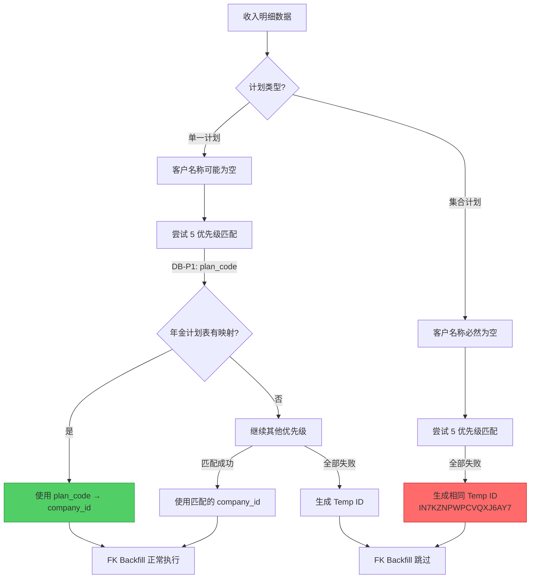

# 空客户名称处理分析

> **分析日期**: 2025-12-31 (更新: 2026-01-01)
> **分析范围**: `annuity_income` 域 ETL 流程
> **数据来源**: `tests/fixtures/real_data/202510/收集数据/数据采集/V2/【for年金机构经营分析】25年10月年金规模收入数据 1110_fork.xlsx`

## 问题描述

当收入明细数据中 `客户名称` 为空时，需要根据 `计划类型` 区分处理逻辑：
- **单一计划**: 应通过多优先级匹配获取正确的 `company_id`
- **集合计划**: 应允许 `company_id` 为 NULL 存储

---

## 数据验证结果

### 源数据分布

| 指标 | 数量 | 占比 |
|------|------|------|
| 总记录数 | 13,639 | 100% |
| 客户名称为空 | **12,095** | **88.7%** |
| └─ 单一计划 | 10,565 | 77.5% |
| └─ 集合计划 | 1,530 | 11.2% |

### 数据库处理结果

| 计划类型 | 总记录 | 客户名称为空 | 有效 company_id | 临时 ID | NULL company_id |
|----------|--------|--------------|-----------------|---------|-----------------|
| 单一计划 | 12,109 | 10,565 | **11,796** (97.4%) | 313 | 0 |
| 集合计划 | 1,530 | 1,530 | 0 | **1,530** (100%) | 0 |

### 单一计划解析详情

单一计划中客户名称为空的 10,565 条记录：
- ✅ **有效 company_id**: 10,268 (97.2%) - 通过 `plan_code` (DB-P1) 优先级成功匹配
- ⚠️ **临时 ID**: 297 (2.8%) - 无法匹配，生成临时 ID

**结论**: 单一计划的多优先级匹配工作**正常**，通过 `年金计划` 表的 `年金计划号 → company_id` 映射成功解析。

### 集合计划解析详情

集合计划 1,530 条记录：
- ❌ 全部获得**相同的临时 ID**: `IN7KZNPWPCVQXJ6AY7`
- ❌ 未允许 `company_id` 为 NULL

**问题**: 集合计划本质上没有对应的单一客户（多个客户共享一个计划），不应该生成临时 ID。

---

## 现有处理流程

### 1. Pipeline 阶段：客户名称保留 null

**文件**: `src/work_data_hub/domain/annuity_income/pipeline_builder.py` L43-51

```python
def _fill_customer_name(df: pd.DataFrame) -> pd.Series:
    """Keep customer name as-is, allow null (consistent with annuity_performance).

    Story 7.3-6: Removed plan name fallback to match annuity_performance behavior.
    """
    if "客户名称" in df.columns:
        return df["客户名称"]  # 保留空值
    else:
        return pd.Series([pd.NA] * len(df), index=df.index)
```

**行为**: 客户名称为空时直接保留 `null`，不使用其他字段作为 fallback。

---

### 2. Company ID 解析优先级

**文件**: `src/work_data_hub/infrastructure/enrichment/resolver/core.py` L240-498

| 优先级 | 策略 | 说明 |
|--------|------|------|
| 1 | YAML Overrides | 5 个子优先级: `plan` → `account` → `hardcode` → `name` → `account_name` |
| 2 | Database Cache | 查询 `enrichment_index` 表缓存 (DB-P1: plan_code 最高优先级) |
| 3 | Existing Column | 直接使用源数据中的 `company_id` (如果存在) |
| 4 | EQC Sync Lookup | 调用 EQC API 实时查询 (有预算限制) |
| 5 | Temp ID Generation | 全部失败 → 生成临时 ID |

**关键发现**: 单一计划通过 **DB-P1 (plan_code)** 优先级成功获取 company_id，无需依赖客户名称。

---

### 3. 临时 ID 生成逻辑

**文件**: `src/work_data_hub/infrastructure/enrichment/resolver/backflow.py` L203-225

```python
def generate_temp_id(customer_name: Optional[str], salt: str) -> str:
    if (
        customer_name is None
        or pd.isna(customer_name)
        or not str(customer_name).strip()
    ):
        customer_name = "__EMPTY__"  # 空名称使用占位符

    return generate_temp_company_id(str(customer_name), salt)
```

**临时 ID 格式**: `IN<16-char-Base32>` (例如 `IN7KZNPWPCVQXJ6AY7`)

> [!WARNING]
> 所有客户名称为空的记录会得到 **相同的 temp ID** (基于 `__EMPTY__` 生成)。

---

### 4. FK Backfill 配置

**文件**: `config/foreign_keys.yml` L252-266

```yaml
annuity_income:
  foreign_keys:
    - name: "fk_customer"
      source_column: "company_id"
      target_table: "年金客户"
      target_key: "company_id"
      target_schema: "mapping"
      mode: "insert_missing"
      skip_blank_values: true # 跳过临时 ID (IN* 格式)
      backfill_columns:
        - source: "company_id"
          target: "company_id"
        - source: "客户名称"
          target: "客户名称"
          optional: true
```

`skip_blank_values: true` 会跳过以 `IN*` 开头的临时 ID，不回填到 `年金客户` 表。

---

## 处理流程图



---

## 问题总结

| 问题 | 描述 | 影响 | 严重程度 |
|------|------|------|----------|
| **集合计划 Temp ID** | 1,530 条集合计划记录得到相同 temp ID | 语义错误，集合计划无单一客户 | 🔴 高 |
| **未区分计划类型** | Company ID 解析逻辑未区分单一/集合计划 | 集合计划不应生成 temp ID | 🔴 高 |
| **单一计划少量临时 ID** | 297 条单一计划记录生成临时 ID | 需补充 年金计划 表映射 | 🟡 中 |

---

## 改进建议

### 短期修复 (P0)

1. **集合计划跳过 Temp ID 生成**

   在 `CompanyIdResolutionStep` 中增加 `计划类型` 判断：
   ```python
   # 集合计划: 允许 company_id 为 NULL，不生成 temp ID
   if row["计划类型"] == "集合计划":
       strategy.generate_temp_ids = False  # 或直接跳过
   ```

2. **修改 ResolutionStrategy 支持条件性 temp ID 生成**

   新增 `skip_temp_id_condition` 参数：
   ```python
   @dataclass
   class ResolutionStrategy:
       skip_temp_id_condition: Optional[Callable[[pd.Series], bool]] = None
   ```

### 中期改进 (P1)

3. **补充缺失的 年金计划 表映射**

   对于 297 条单一计划临时 ID 记录，调查其 `计划代码` 并补充到 `mapping.年金计划` 表。

4. **Gold Schema 允许 company_id 为 NULL**

   确认 `GoldAnnuityIncomeSchema` 中 `company_id` 已设为 `nullable=True`。

### 长期架构 (P2)

5. **分离"客户识别"与"数据存储"**
   - 集合计划数据存储时 `company_id` 为 NULL
   - 后续通过手动或批量任务补充特定集合计划的 company_id（如需要）

---

## 相关文件

| 文件 | 说明 |
|------|------|
| `src/work_data_hub/domain/annuity_income/pipeline_builder.py` | Pipeline 构建，客户名称处理 |
| `src/work_data_hub/infrastructure/enrichment/resolver/core.py` | Company ID 解析核心逻辑 |
| `src/work_data_hub/infrastructure/enrichment/resolver/db_strategy.py` | DB-P1..P5 数据库缓存策略 |
| `src/work_data_hub/infrastructure/enrichment/resolver/backflow.py` | Temp ID 生成 |
| `config/foreign_keys.yml` | FK Backfill 配置 |
| `mapping.年金计划` | 计划代码 → company_id 映射表 |

---

## 验证 SQL

```sql
-- 检查按计划类型分布的 company_id 情况
SELECT
    "计划类型",
    COUNT(*) as total_records,
    SUM(CASE WHEN "客户名称" IS NULL OR "客户名称" = '' THEN 1 ELSE 0 END) as empty_customer_name,
    SUM(CASE WHEN company_id LIKE 'IN%' THEN 1 ELSE 0 END) as temp_id_count,
    SUM(CASE WHEN company_id IS NULL THEN 1 ELSE 0 END) as null_company_id,
    SUM(CASE WHEN company_id IS NOT NULL AND company_id NOT LIKE 'IN%' THEN 1 ELSE 0 END) as valid_company_id
FROM business."收入明细"
GROUP BY "计划类型"
ORDER BY "计划类型";
```
